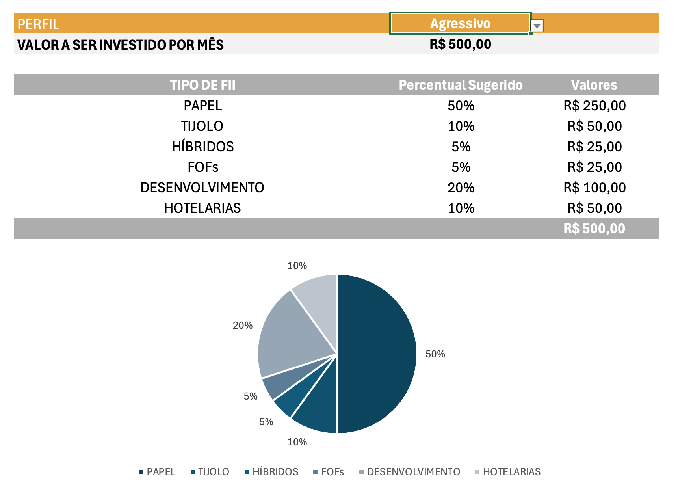

````markdown
<p align="center">
  
</p>

<h1 align="center">Du Invest</h1>

<p align="center">
  Simulador de investimentos desenvolvido em Microsoft Excel.
</p>

---

## 📊 Sobre o projeto

O **Du Invest** é uma ferramenta desenvolvida em Microsoft Excel para simular investimentos mensais, projetar a evolução do patrimônio ao longo do tempo e sugerir a distribuição do aporte entre diferentes tipos de Fundos Imobiliários (FIIs), de acordo com o perfil do investidor.

A ferramenta utiliza funções financeiras, funções de busca, intervalos nomeados, validação de dados e uma tabela auxiliar para tornar a simulação dinâmica e interativa.

---

## ❓ Perguntas respondidas pela ferramenta

A área de **Investimento Mensal** responde às principais perguntas da simulação:

### 1. Quanto investir por mês?

O usuário informa o valor que pretende investir mensalmente no campo de aporte.

### 2. Por quantos anos investir?

O período da simulação é definido pelo usuário em anos.

### 3. Qual a taxa de rendimento mensal?

A taxa mensal utilizada na projeção pode ser informada e alterada pelo usuário.

### 4. Qual será o patrimônio acumulado?

A planilha calcula automaticamente o patrimônio estimado ao final do período, considerando o aporte mensal, a taxa de rendimento e o tempo de investimento.

### 5. Quanto esse patrimônio poderá gerar de dividendos mensais?

A ferramenta também estima o rendimento mensal da carteira com base no patrimônio projetado.

Além da simulação principal, a planilha apresenta cenários de evolução do patrimônio para diferentes períodos:

- 2 anos;
- 5 anos;
- 10 anos;
- 20 anos;
- 30 anos.

---

## 💰 Uso da função VF

A função `VF` é utilizada para calcular o **Valor Futuro** dos aportes mensais.

Na simulação principal, a fórmula segue esta lógica:

```excel
=VF(taxa_mensal;qtd_anos*12;aporte*-1)
```

O número de anos é multiplicado por `12`, pois os aportes e a taxa de rendimento utilizados na ferramenta são mensais.

O aporte é multiplicado por `-1` porque representa uma saída de caixa. Dessa forma, o Excel apresenta o patrimônio futuro como um valor positivo.

A mesma lógica é utilizada nos cenários de 2, 5, 10, 20 e 30 anos.

---

## 🔎 Uso da função PROCV

A função `PROCV` é utilizada para buscar automaticamente o percentual correspondente a cada tipo de FII de acordo com o perfil selecionado.

A ferramenta combina duas informações:

- o perfil do investidor;
- o tipo de FII.

Por exemplo:

```text
Conservador-PAPEL
```

Essa combinação é utilizada como chave de busca na tabela auxiliar localizada na `Planilha2`.

Exemplo de fórmula:

```excel
=PROCV($C$29&"-"&$B33;Planilha2!$A:$D;4;FALSO)
```

Ao alterar o perfil na lista de seleção, o `PROCV` consulta a tabela auxiliar e retorna automaticamente os novos percentuais da carteira.

Esses percentuais são utilizados para calcular quanto do aporte mensal será destinado a cada categoria de FII.

---

## 🏷️ Intervalos nomeados

Para deixar as fórmulas mais legíveis e facilitar a manutenção da ferramenta, foram criados os seguintes intervalos nomeados:

| Intervalo nomeado | Finalidade |
|---|---|
| `salario` | Salário utilizado como referência |
| `sugestao_investimento` | Valor sugerido para investimento |
| `aporte` | Valor investido mensalmente |
| `qtd_anos` | Quantidade de anos da simulação |
| `taxa_mensal` | Taxa de rendimento mensal |
| `patrimonio` | Patrimônio futuro projetado |
| `rendimento_carteira` | Percentual utilizado para estimar o rendimento da carteira |

O uso desses nomes permite escrever fórmulas mais compreensíveis.

Por exemplo:

```excel
=VF(taxa_mensal;qtd_anos*12;aporte*-1)
```

em vez de utilizar apenas referências de células.

---

## 👤 Perfis de investimento

A ferramenta possui três perfis de investimento.

### 🟢 Conservador

| Tipo de FII | Percentual |
|---|---:|
| Papel | 30% |
| Tijolo | 50% |
| Híbridos | 10% |
| FOFs | 10% |
| Desenvolvimento | 0% |
| Hotelarias | 0% |
| **Total** | **100%** |

### 🟡 Moderado

| Tipo de FII | Percentual |
|---|---:|
| Papel | 32% |
| Tijolo | 35% |
| Híbridos | 8% |
| FOFs | 5% |
| Desenvolvimento | 10% |
| Hotelarias | 10% |
| **Total** | **100%** |

### 🔴 Agressivo

| Tipo de FII | Percentual |
|---|---:|
| Papel | 50% |
| Tijolo | 10% |
| Híbridos | 5% |
| FOFs | 5% |
| Desenvolvimento | 20% |
| Hotelarias | 10% |
| **Total** | **100%** |

Todos os perfis totalizam **100% do aporte mensal**.

Os percentuais utilizados tiveram como referência a estrutura apresentada na ferramenta-base do **Expert** e foram organizados na `Planilha2`, utilizada como tabela auxiliar para as consultas realizadas com `PROCV`.

---

## 📈 Distribuição da carteira

Depois que o perfil é escolhido, a ferramenta distribui o aporte mensal entre os diferentes tipos de FIIs.

O cálculo segue a lógica:

```excel
=percentual_do_perfil*aporte
```

Por exemplo, considerando um aporte de:

```text
R$ 500,00
```

e um percentual de:

```text
30%
```

o valor destinado à categoria será:

```text
R$ 150,00
```

A soma de todas as categorias corresponde a **100% do aporte informado**.

A distribuição é alterada automaticamente sempre que o usuário seleciona outro perfil de investimento.

---

# 🧪 Evidências de funcionamento

Para demonstrar que a ferramenta funciona corretamente, foram realizadas simulações utilizando os **mesmos dados de entrada**, alterando apenas o perfil do investidor.

Foram mantidos os mesmos valores de:

- salário;
- aporte mensal;
- quantidade de anos;
- taxa de rendimento.

Dessa forma, é possível visualizar claramente como a alteração do perfil modifica a distribuição da carteira.

---

## 🟢 Simulação — Perfil Conservador

Na primeira simulação foi selecionado o perfil **Conservador**.

O print abaixo apresenta os dados utilizados na simulação, o perfil selecionado, os percentuais de cada categoria de FII e os respectivos valores da distribuição do aporte.

<p align="center">
  
</p>

No perfil **Conservador**, a maior participação da carteira está concentrada em FIIs de **Tijolo** e **Papel**.

A distribuição total corresponde a **100% do aporte mensal**.

---

## 🔴 Simulação — Perfil Agressivo

Na segunda simulação foram mantidos os mesmos valores utilizados anteriormente.

A única alteração realizada foi a mudança do perfil de **Conservador** para **Agressivo**.

<p align="center">
  
</p>

Ao alterar o perfil, os percentuais são atualizados automaticamente através do `PROCV`.

Consequentemente, os valores destinados a cada tipo de FII também são recalculados.

A soma da distribuição continua correspondendo a **100% do aporte mensal**.

---

## 🔄 Como ocorre a mudança de perfil

O funcionamento da distribuição pode ser resumido da seguinte forma:

```text
Perfil selecionado
        ↓
      PROCV
        ↓
  Tabela auxiliar
        ↓
Percentuais do perfil
        ↓
Distribuição do aporte
```

Dessa forma, o usuário não precisa alterar manualmente os percentuais da carteira.

Basta selecionar outro perfil para que a distribuição seja atualizada.

---

## 🛠️ Alterações em relação à ferramenta do Expert

A ferramenta-base apresentada pelo Expert foi utilizada como referência para o desenvolvimento deste projeto.

Nesta versão foram realizadas adaptações e melhorias, entre elas:

- criação da identidade **Du Invest**;
- desenvolvimento de uma identidade visual própria;
- aplicação de uma nova paleta de cores;
- reorganização das informações;
- criação de intervalos nomeados;
- organização da tabela auxiliar dos perfis;
- utilização do `PROCV` para automatizar a escolha dos percentuais;
- distribuição automática do aporte;
- apresentação de diferentes cenários de patrimônio;
- melhoria da organização visual dos resultados;
- personalização da experiência de utilização da ferramenta.

O objetivo foi manter os conceitos apresentados na atividade, mas desenvolver uma versão própria e personalizada da solução.

---

## 🔐 Dados utilizados

Os valores apresentados na versão publicada da ferramenta são **dados fictícios utilizados exclusivamente para demonstração**.

Nenhum salário, patrimônio ou outra informação financeira pessoal foi utilizado no arquivo disponibilizado publicamente.

---

## ▶️ Como utilizar

1. Faça o download do arquivo `Du_Invest.xlsx`.
2. Abra a planilha no Microsoft Excel.
3. Informe os dados da simulação.
4. Defina o aporte mensal.
5. Informe a quantidade de anos.
6. Informe a taxa de rendimento mensal.
7. Escolha o perfil do investidor.
8. Observe a projeção do patrimônio.
9. Analise os cenários apresentados.
10. Confira a distribuição sugerida do aporte entre os tipos de FIIs.

---

## 📂 Estrutura do repositório

```text
du-invest/
│
├── Du_Invest.xlsx
├── README.md
│
├── assets/
│   └── logo-du-invest.png
│
└── prints/
    ├── perfil-conservador.png
    └── perfil-agressivo.png
```

---

## 💻 Tecnologias e recursos utilizados

- Microsoft Excel;
- função `VF`;
- função `PROCV`;
- intervalos nomeados;
- validação de dados;
- referências entre planilhas;
- tabelas auxiliares;
- Git;
- GitHub;
- Markdown.

---

## 🎯 Objetivo do projeto

O objetivo deste projeto é demonstrar a aplicação prática de recursos do Microsoft Excel na construção de uma ferramenta de simulação financeira.

O projeto permite demonstrar conhecimentos em:

- funções financeiras;
- funções de busca;
- organização de dados;
- lógica de distribuição percentual;
- referências entre planilhas;
- intervalos nomeados;
- validação de dados;
- construção de ferramentas interativas;
- documentação técnica;
- versionamento de projetos com Git e GitHub.

---

## 👨‍💻 Autor

Desenvolvido por **Ducosmo**.
````
