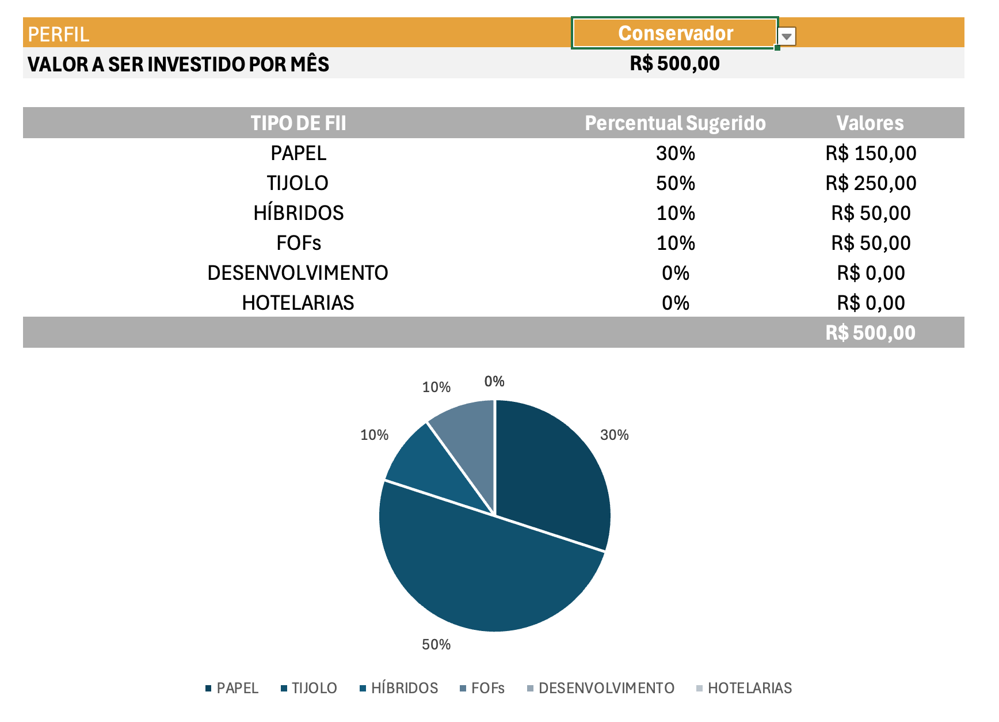

<p align="center">
  
</p>

<h1 align="center">Du Invest</h1>

<p align="center">
  Simulador de investimentos desenvolvido em Microsoft Excel
</p>

<p align="center">
  <a href="./Du_Invest.xlsx"><strong>📥 Baixar a planilha</strong></a>
</p>

---

## 📊 Sobre o projeto

O **Du Invest** é uma ferramenta desenvolvida em Microsoft Excel para simular investimentos mensais, projetar a evolução do patrimônio e sugerir a distribuição do aporte entre diferentes categorias de Fundos Imobiliários (FIIs), de acordo com o perfil do investidor.

O projeto utiliza recursos como:

- função financeira `VF`;
- função de busca `PROCV`;
- intervalos nomeados;
- validação de dados;
- referências entre planilhas;
- tabela auxiliar de perfis;
- cálculos automáticos de distribuição do aporte.

> **Observação:** os valores financeiros disponíveis no arquivo publicado são fictícios e foram utilizados exclusivamente para demonstração.

---

## ❓ O que a ferramenta responde?

A planilha foi construída para responder às principais perguntas de uma simulação de investimentos.

| Pergunta | Onde encontrar a resposta |
|---|---|
| **Quanto investir por mês?** | No campo de aporte da área **Investimento Mensal** |
| **Por quantos anos investir?** | No campo de período da simulação |
| **Qual taxa de rendimento mensal utilizar?** | No campo destinado à taxa mensal |
| **Qual será o patrimônio acumulado?** | No resultado de patrimônio projetado |
| **Quanto o patrimônio poderá gerar por mês?** | No cálculo de rendimento mensal da carteira |

Além da projeção principal, a ferramenta apresenta cenários de patrimônio para:

- **2 anos**
- **5 anos**
- **10 anos**
- **20 anos**
- **30 anos**

---

## 💰 Como a função VF entra nos cálculos?

A função `VF` é utilizada para calcular o **valor futuro dos aportes mensais**.

Na simulação principal, a lógica utilizada é:

```excel
=VF(taxa_mensal;qtd_anos*12;aporte*-1)
```

### Como funciona?

- `taxa_mensal` representa a rentabilidade mensal utilizada na simulação;
- `qtd_anos*12` transforma o prazo informado em anos para meses;
- `aporte` representa o valor investido mensalmente;
- `aporte*-1` é utilizado porque o aporte representa uma saída de caixa.

O resultado da fórmula é o patrimônio projetado ao final do período.

A mesma lógica é utilizada nos cenários de **2, 5, 10, 20 e 30 anos**.

---

## 🔎 Como o PROCV entra nos cálculos?

O `PROCV` é utilizado para localizar automaticamente o percentual correspondente a cada categoria de FII de acordo com o perfil selecionado.

A ferramenta combina:

**Perfil + Tipo de FII**

Por exemplo:

```text
Conservador-PAPEL
```

Essa combinação funciona como chave de busca na tabela auxiliar da `Planilha2`.

Exemplo:

```excel
=PROCV($C$29&"-"&$B33;Planilha2!$A:$D;4;FALSO)
```

Quando o usuário troca o perfil na lista, o `PROCV` consulta a tabela auxiliar e retorna os percentuais correspondentes.

O funcionamento pode ser resumido assim:

```text
Perfil selecionado
       ↓
     PROCV
       ↓
Tabela auxiliar
       ↓
Percentuais do perfil
       ↓
Distribuição do aporte
```

Dessa forma, não é necessário alterar manualmente os percentuais da carteira.

---

## 🏷️ Intervalos nomeados

Para deixar as fórmulas mais legíveis e facilitar a manutenção da planilha, foram criados os seguintes intervalos nomeados:

| Intervalo | Finalidade |
|---|---|
| `salario` | Salário utilizado como referência |
| `sugestao_investimento` | Valor sugerido para investimento |
| `aporte` | Valor investido mensalmente |
| `qtd_anos` | Quantidade de anos da simulação |
| `taxa_mensal` | Taxa de rendimento mensal |
| `patrimonio` | Patrimônio futuro projetado |
| `rendimento_carteira` | Percentual utilizado para estimar o rendimento da carteira |

Isso permite utilizar fórmulas mais fáceis de compreender, como:

```excel
=VF(taxa_mensal;qtd_anos*12;aporte*-1)
```

em vez de trabalhar somente com referências de células.

---

## 👤 Perfis de investimento

A ferramenta possui três perfis: **Conservador, Moderado e Agressivo**.

| Tipo de FII | Conservador | Moderado | Agressivo |
|---|---:|---:|---:|
| Papel | 30% | 32% | 50% |
| Tijolo | 50% | 35% | 10% |
| Híbridos | 10% | 8% | 5% |
| FOFs | 10% | 5% | 5% |
| Desenvolvimento | 0% | 10% | 20% |
| Hotelarias | 0% | 10% | 10% |
| **Total** | **100%** | **100%** | **100%** |

Os percentuais tiveram como referência a estrutura de perfis apresentada na **ferramenta-base do Expert** e foram organizados em uma tabela auxiliar na `Planilha2`.

Todos os perfis somam exatamente **100% do aporte mensal**.

---

## 📈 Distribuição da carteira

Depois que o perfil é selecionado, a planilha aplica os percentuais ao valor que será investido mensalmente.

A lógica utilizada é:

```excel
=percentual_do_perfil*aporte
```

### Exemplo

Se o aporte mensal for:

```text
R$ 500,00
```

e uma categoria representar:

```text
30%
```

o valor destinado a essa categoria será:

```text
R$ 150,00
```

A soma dos valores distribuídos entre todas as categorias corresponde a **100% do aporte mensal**.

Ao trocar o perfil, os percentuais e os respectivos valores da carteira são recalculados.

---

# 🧪 Evidências de funcionamento

Para demonstrar o funcionamento da ferramenta, foi utilizada **a mesma simulação em dois perfis diferentes**.

Foram mantidos os mesmos valores de:

- salário;
- aporte mensal;
- período de investimento;
- taxa de rendimento.

A única alteração entre os dois testes foi o **perfil de investimento**.

Isso permite verificar visualmente que a mudança do perfil altera a distribuição da carteira.

---

## 🟢 Perfil Conservador

Na primeira simulação foi selecionado o perfil **Conservador**.

<p align="center">
  
</p>

Nesse perfil, a maior parcela do aporte está concentrada principalmente nas categorias de **Tijolo** e **Papel**.

Os valores da tabela correspondem à distribuição do aporte de acordo com os percentuais do perfil Conservador.

---

## 🔴 Perfil Agressivo

Na segunda simulação, os mesmos dados foram mantidos e apenas o perfil foi alterado para **Agressivo**.

<p align="center">
  
</p>

Ao alterar o perfil, o `PROCV` retorna uma nova combinação de percentuais e, consequentemente, modifica a distribuição do aporte.

Mesmo com uma composição diferente, o total continua correspondendo a **100% do valor investido mensalmente**.

---

## 🛠️ O que foi alterado em relação à ferramenta do Expert?

A ferramenta apresentada pelo Expert foi utilizada como referência para o desenvolvimento do projeto.

A versão **Du Invest** recebeu diferentes adaptações e personalizações, entre elas:

- criação de uma identidade própria para o projeto;
- desenvolvimento da marca **Du Invest**;
- aplicação de uma nova paleta de cores;
- reorganização visual das informações;
- criação e utilização de intervalos nomeados;
- organização da tabela auxiliar de perfis;
- automação dos percentuais com `PROCV`;
- distribuição automática do aporte;
- apresentação de cenários para diferentes períodos;
- personalização da área de resultados;
- melhoria da leitura e organização da ferramenta.

O objetivo foi manter os conceitos trabalhados na atividade, mas desenvolver uma versão própria e visualmente personalizada.

---

## 🔐 Dados utilizados

Todos os valores financeiros presentes na versão publicada são **dados de exemplo**.

O arquivo disponível neste repositório não contém:

- salário pessoal;
- patrimônio pessoal;
- valores reais de investimentos;
- outras informações financeiras privadas.

---

## ▶️ Como utilizar

1. Baixe o arquivo [`Du_Invest.xlsx`](./Du_Invest.xlsx).
2. Abra a planilha no Microsoft Excel.
3. Informe os dados da simulação.
4. Defina o aporte mensal.
5. Informe a quantidade de anos.
6. Informe a taxa de rendimento mensal.
7. Selecione o perfil de investimento.
8. Observe o patrimônio projetado.
9. Analise os cenários apresentados.
10. Confira a distribuição do aporte entre as categorias de FIIs.

---

## 📂 Estrutura do repositório

```text
du-invest/
│
├── Du_Invest.xlsx
├── README.md
│
├── assets/
│   └── logo-du-invest.png
│
└── prints/
    ├── perfil-conservador.png
    └── perfil-agressivo.png
```

---

## 💻 Tecnologias e recursos utilizados

- Microsoft Excel
- Função `VF`
- Função `PROCV`
- Intervalos nomeados
- Validação de dados
- Referências entre planilhas
- Tabelas auxiliares
- Git
- GitHub
- Markdown

---

## 🎯 Objetivo do projeto

O objetivo deste projeto é demonstrar a aplicação prática de recursos do Microsoft Excel na construção de uma ferramenta de simulação financeira.

O projeto evidencia conhecimentos em:

- funções financeiras;
- funções de busca;
- organização de dados;
- referências entre planilhas;
- intervalos nomeados;
- lógica de distribuição percentual;
- validação de dados;
- construção de ferramentas interativas;
- documentação de projetos;
- versionamento com Git e GitHub.

---

## 👨‍💻 Autor

Desenvolvido por **Ducosmo**.
